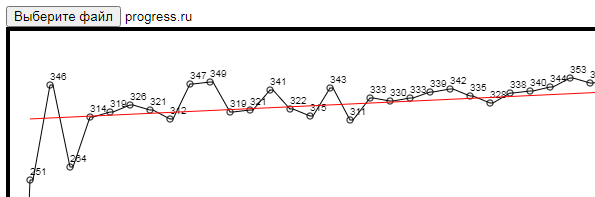

# Вычисление линии тренда в клавиатурном тренажере Stamina

Пользователю предлагается открыть файл со статистикой набора клавиатурного тренажера <a href="https://stamina.ru/" target="_blank">Stamina</a>: каталог_программы\Users\имя_пользователя\progress.ru. После открытия программа строит график результатов и рассчитывает линию тренда по формулам. Используется JavaScript, Canvas.
 
<a href="http://goshanoob.eu5.org/javascript-examples/%D0%92%D1%8B%D1%87%D0%B8%D1%81%D0%BB%D0%B5%D0%BD%D0%B8%D0%B5%20%D0%BB%D0%B8%D0%BD%D0%B8%D0%B8%20%D1%82%D1%80%D0%B5%D0%BD%D0%B4%D0%B0/trendLine.html" target="_blank">Посмотреть живьем</a>
 
