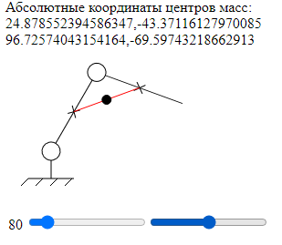

# Программа вычисления центров масс механических систем

SVG-модель кинематических схем роботов-манипуляторов, JS-фукнкции для вычисления положения центров масс и изменения положения звеньев при взимодействии с элементами управления.
 
<a href="http://goshanoob.eu5.org/javascript-examples/%D0%A6%D0%B5%D0%BD%D1%82%D1%80%D1%8B%20%D0%9C%D0%B0%D1%81%D1%81/index.html" target="_blank">Посмотреть живьем</a>
 
