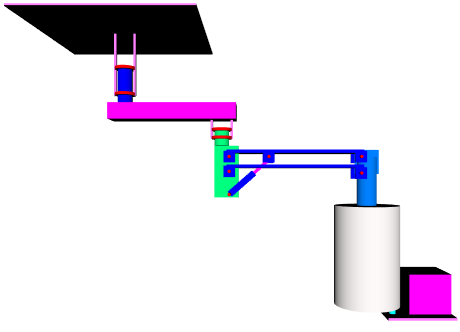

# Модель подвеса медицинского оборудования

X3D- и SVG-модели подвеса медицинского оборудования, JS-фукнкции для вычисления сил, действующих на звенья подвеса в различных положениях. Изменение положения подвеса при взимодействии с элементами управления.
 
